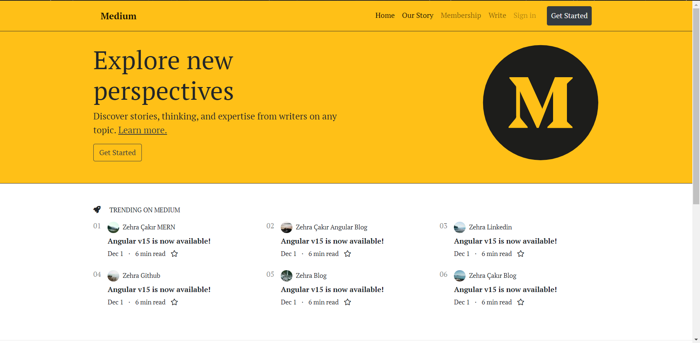
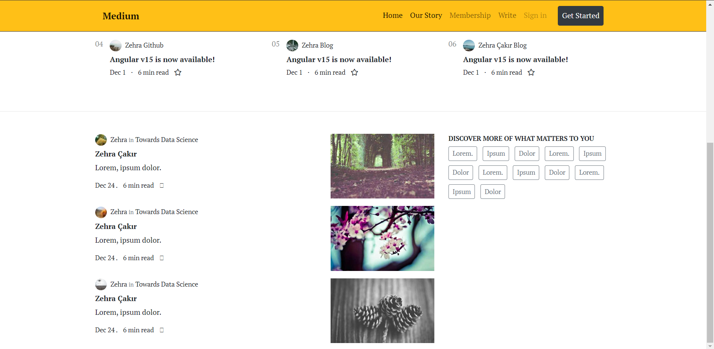

# Medium Clone Work with Bootstrap
* I made a clone of medium.com with Bootstrap.

* [Click to download Bootstrap](https://getbootstrap.com/docs/4.5/getting-started/download/#compiled-css-and-js)

* [Click to download Font Awesome ](https://fontawesome.com/download)

---

* Screenshots of my clone I created

---

